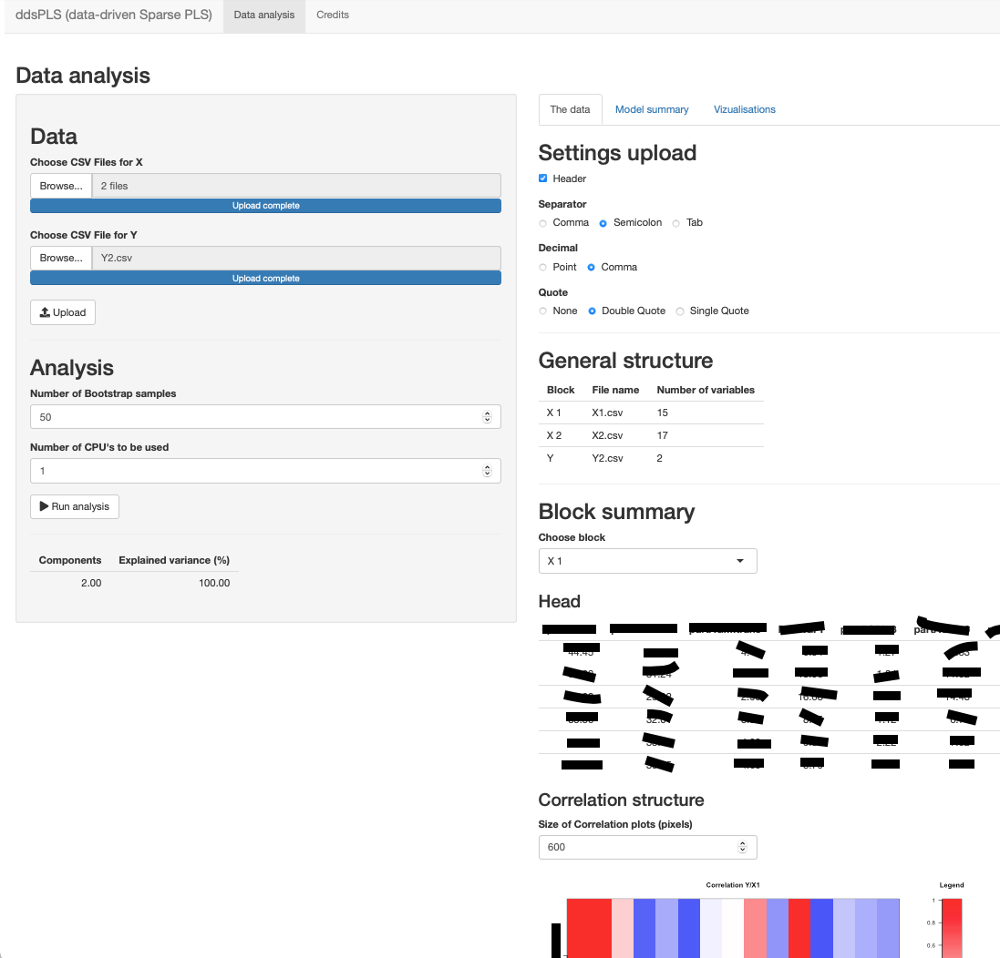

# Data Driven Sparse PLS (**ddsPLS**)

**ddsPLS** is a sparse PLS formulation based on soft-thresholding estimations of covariance matrices.

## Installation

  * From the under development repository from GitHub thanks to `devtools`

  ```r
  # install.packages("devtools")
  devtools::install_github("hlorenzo/ddsPLS", build_vignettes = TRUE)
  ```
  
Once that package is installed, you can access the `vignette("start_ddsPLS")` using that command.

  ```r
  vignette("ddsPLS")
  ```

## The application

It is also possible to use the developped applet using 

  ```r
  ddsPLS_App()
  ```

and it should start an interactive interface which should look like



## Thanks for using!
