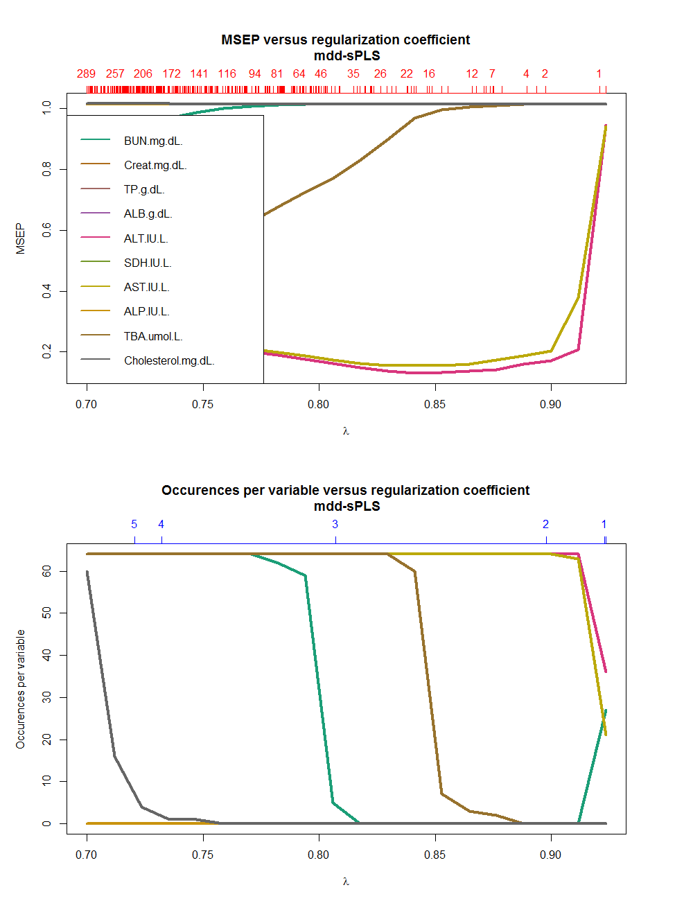
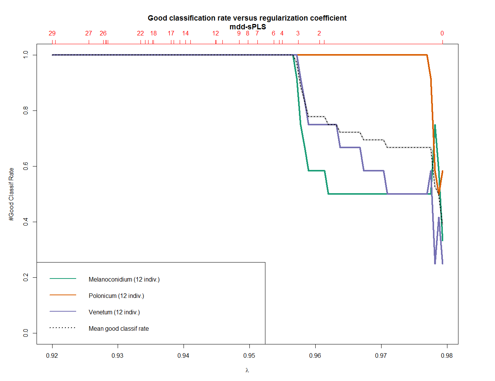
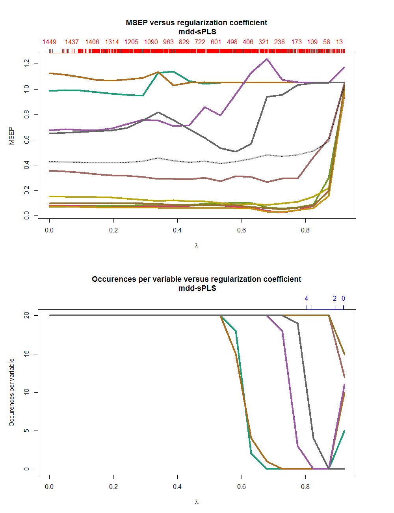

Control the number of $\lambda$ parameters to test in the cross-validation processes
```{r,eval=F}
n_lambda <- 20
```
Control the number of cores to use in the cross-validation processes. If equals $1$, then no parallel computation structure is deployed
```{r,eval=F}
NCORES <- 7
```
Load the **ddsPLS** package
```{r, fig.show='hold',message=FALSE}
library(ddsPLS)
```


# Mono-block
The here used method can be used on mono and multi-block datasets with no missing values.
In the case on mono-block datasets, there is no current developpment to deal with missing samples. Actually this would imply that for a given individual, no covariate is known. Which block any inference.
## Regression case
The regression case has been treated through a toy example well know dataset in that section.
### Build a model
We have worked on the Liver Toxicity dataset, see @bushel2007simultaneous. This data set contains the expression measure of 3116 genes and 10 clinical measurements for 64 subjects (rats) that were exposed to non-toxic, moderately toxic or severely toxic doses of acetaminophen in a controlled experiment. Therefore the structure is :
$$\mathbf{X}\in\mathbb{R}^{64\times3116},\mathbf{Y}\in\mathbb{R}^{64\times10}$$
```{r, fig.show='hold',message=FALSE,eval=F}
library(doParallel)
library(RColorBrewer)
data("liver.toxicity")
X <- scale(liver.toxicity$gene)
Y <- scale(liver.toxicity$clinic)
mddsPLS_model_reg <- mddsPLS(Xs = X,Y = Y,lambda=0.9,R = 1,
                             mode = "reg",verbose = TRUE)
```

### Cross-validation
The cross-validation process is started in a leave-one-out design along $1$ dimension. **NCORES** fixes the number of cores in the paralellized process, **n\_lambda** fixes the number of regularization terms to be tested.
```{r,fig.width=12, fig.height=10,message=FALSE,eval=F}
res_cv_reg <- perf_mddsPLS(Xs = X,Y = Y,
                           R = 1,lambda_min=0.7,n_lambda=n_lambda,
                           mode = "reg",NCORES = NCORES,kfolds = "loo")
plot(res_cv_reg,legend_names=colnames(Y))
```



## Classification case
### Build a model
The data set penicilliumYES has 36 rows and 3754 columns, see @clemmensen2007method The variables are 1st order statistics from multi-spectral images of three species of Penicillium fungi: Melanoconidium, Polonicum, and Venetum. These are the data used in the Clemmemsen et al "Sparse Discriminant Analysis" paper. Therefore the structure is, where $\mathbf{Y}$ is the dummy matrix of the $3$ classes :
$$\mathbf{X}\in\mathbb{R}^{36\times3754},\mathbf{Y}\in\mathbb{R}^{36\times3}$$

```{r, fig.show='hold',fig.width=7, fig.height=5,message=FALSE,eval=T}
data("penicilliumYES")
X <- penicilliumYES$X
X <- scale(X[,which(apply(X,2,sd)>0)])
classes <- c("Melanoconidium","Polonicum","Venetum")
Y <- as.factor(unlist(lapply(classes,
                             function(tt){rep(tt,12)})))
mddsPLS_model_class <- mddsPLS(Xs = X,Y = Y,lambda = 0.956,R = 2,
                               mode = "clas",verbose = TRUE)
```

### Plot the two first axes 
```{r, fig.show='hold',fig.width=7, fig.height=5,message=FALSE,eval=T}
plot(mddsPLS_model_class$mod$t,col=Y,pch=as.numeric(Y)+15,cex=2,
     xlab="1st X component, 2 var. selected",
     ylab="2nd X component, 2 var. selected")
legend(-2,0,legend=classes,col=1:3,pch=15+(1:3),box.lty=0,y.intersp=2)
```

### Cross-validation
The cross-validation process is started in a fold-fixed design, because each sample is repeated $3$ times. In that sense this is a leave-one-out process. $R=2$ fixes the number of dimensions to 2. **NCORES** fixes the number of cores in the paralellized process, **n\_lambda** fixes the number of regularization terms to be tested.
```{r,fig.width=7, fig.height=6,message=FALSE,eval=F}
res_cv_class <- perf_mddsPLS(X,Y,R = 2,lambda_min=0.92,n_lambda=n_lambda,
                             mode = "clas",NCORES = NCORES,
                             fold_fixed = rep(1:12,3))
plot(res_cv_class,legend_names = levels(Y),pos_legend="bottomleft")
```


# Multi-block simulation case
A simulation process is proposed to have an idea of the behavior of the method in the multi-block context with missing values.

## Simulation model
According to what have been proposed in [@johnstone2004sparse], the following simulations follow the spike covariance models
$$\left\{\begin{aligned}
{\bf X}_1&= {\bf L}{\bf \Omega}_1^{1/2}{\bf U}^T_{1,mod}+{\bf E}_1\\
&\vdots\\
{\bf X}_T&= {\bf L}{\bf \Omega}_T^{1/2}{\bf U}^T_{T,mod}+{\bf E}_T\\
{\bf Y}&= {\bf L}{\bf \Omega}_y^{1/2}{\bf V}^T_{mod}+{\bf E}_y\\
\end{aligned}
\right.,$$
where $({\bf \Omega}_t)_{t=1\cdots T}$ and ${\bf \Omega}_y$ are $R$-dimensional diagonal matrices with strictly positive diagonal elements. $({\bf U}_{t,mod}\in\mathbb{R}^{p_t\times R})_{t=1\cdots T}$ and ${\bf V}_{mod}\in\mathbb{R}^{q\times R}$ are  matrices with orthonormal columns. ${\bf L}\in\mathbb{R}^{n\times R}$ is a matrix where elements are i.i.d. standard Gaussian random effects, $({\bf E}_t\in\mathbb{R}^{n\times p_t})_{t=1\cdots T}$ (respectively ${\bf E}_y\in\mathbb{R}^{n\times q}$) are matrices such that each row follows the standard multivariate normal distribution $(N_{p_t}(0,\mathbb{I}_{p_t}))_{t=1\cdots T}$ (respectively $N_q(0,\mathbb{I}_q)$) and the $n$ rows are independent and mutually independent noise vectors. Let us mention that the matrix ${\bf L}$ does not depend of $t$ and thus introduces a common structure between the ${\bf X}_t$'s and $\bf Y$ models.

## Simulation parameters
Usual parameters used to simulate datasets
```{r,fig.width=7, fig.height=6,message=FALSE,eval=F}
n <- 20 # number of individuals
R <- 5 # number of created dimensions in __L__
T_ <- 10 # number of blocks
sd_error <- 0.1 # Standard-deviation of the spike-covariance model element matrices of $E_t$ and $E_y$
p_s <- sample(x = 100:200,size = T_,replace = T) # number of variables per block $X_t$
q <- 10  # number of variable in $Y$
R_real <- 3 # number of components of __L__ described in __Y__
p_missing <- 0.3 # the proportion of missing values
```

Possible values for $({\bf \Omega}_t^{1/2})_{t=1\cdots T}$ and ${\bf \Omega}_y^{1/2}$ diagonal elements are then chosen. It has been chosen to consider low elements, close to $0$, and high elements, $\approx 1$.
```{r,fig.width=7, fig.height=6,message=FALSE,eval=F}
o_x <- seq(0,1,length.out = 1000)
o_y <- (o_x-0.5)^2
o_y[which(o_y<0.2)] <- 0 # keep only low or high potential diagonal elements
all_omegas <- sample(o_x,prob = o_y,size = R*T_) # Select R*T_ elements

all_omegas_y <- sample(o_x,prob = o_y,size = R_real) # Select R_real elements
Omegas_y <- diag(c(all_omegas_y,rep(0,R-R_real))) # Create the Omega_y diagonal matrix
```

## Generate covariate dataset
__Xs__ is a list of matrices corresponding to the defined spike-covariance model.
```{r,message=FALSE,eval=F}
Xs <- list()
L <- matrix(rnorm(n*R),nrow = n)
for(k in 1:T_){
    Omegas <- diag(all_omegas[1:R+(k-1)*R])
    Us <- svd(matrix(rnorm(p_s[k]*n),nrow = n))$v[,1:R]
    E_k <- matrix(rnorm(n*p_s[k],sd = sd_error),nrow = n)
    Xs[[k]]<- scale(E_k + tcrossprod(L%*%Omegas,Us))
}
```

A proportion $p_{missing}$ of the data is missing, the following script permits to remove that proportion of samplestaking into account that a given participant must not be missing for all blocks.
```{r,message=FALSE,eval=F}
values <- expand.grid(1:n,1:T_)
values_id <- 1:(n*T_)
probas <- rep(1,n*T_)/(n*T_)
number_miss_samp <- floor(n*T_*p_missing)
missin_samp <- matrix(NA,nrow = number_miss_samp,ncol = 2)
for(sam in 1:number_miss_samp){
  curr_id <- values_id[sample(values_id,size = 1,prob = probas)]
  missin_samp[sam,1] <- values[curr_id,1]
  missin_samp[sam,2] <- values[curr_id,2]
  probas[curr_id] <- 0
  if(length(which(na.omit(missin_samp[,1])==missin_samp[sam,1]))==n){
    probas[which(values[,1]==missin_samp[sam,1])] <- 0
  }
  Xs[[missin_samp[sam,2]]][missin_samp[sam,1],] <- NA ## Remove individual value
}

```

## Generate response matrix
__Y__ is a matrix also corresponding to the defined spike-covariance model.
```{r,message=FALSE,eval=F}
V <- svd(matrix(rnorm(q*n),nrow = n))$v[,1:R]
E_y <- matrix(rnorm(q*n,sd = sd_error),nrow = n)
Y <- tcrossprod(L%*%Omegas_y,V)
Y <- scale(E_y + Y)
```

## Cross-validation
The cross-validation process is started in a leave-one-out design along $3$ dimensions. **NCORES** fixes the number of cores in the paralellized process, **n\_lambda** fixes the number of regularization terms to be tested.
```{r,message=FALSE,fig.width=7, fig.height=10,eval=F}
cross_valid <- perf_mddsPLS(Xs,Y,n_lambda = n_lambda,
                            R = 3,kfolds = "loo",NCORES = NCORES)
plot(cross_valid,plot_mean = T)
```

In that simulation, $5$ **Y** variables are very well predicted for $\lambda <0.8$ and a minimum of error is reached for $\lambda \approx 0.72$.


# References
